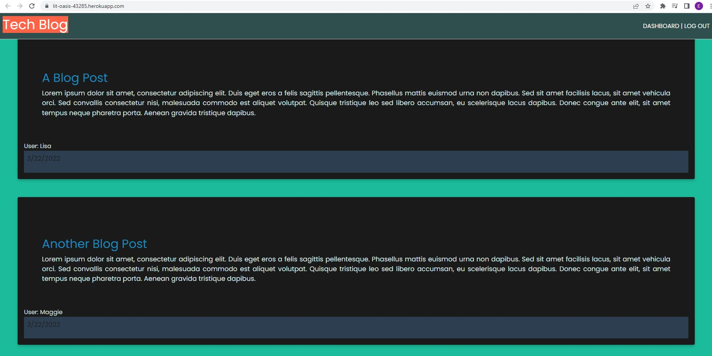
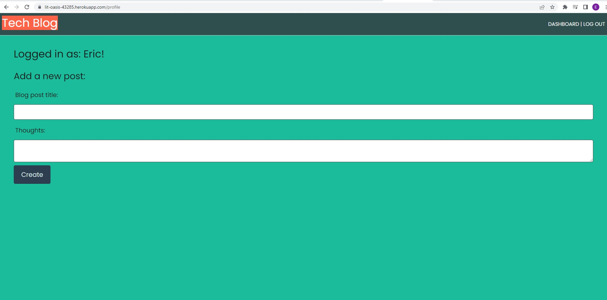
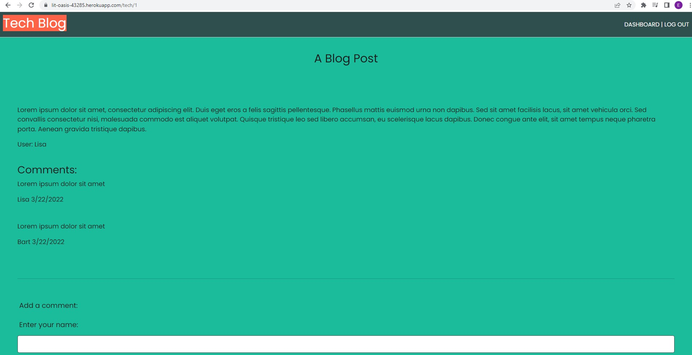

# MVC-Tech-Blog


## Description

This is a tech blog utilizing [model-view-controller](https://en.wikipedia.org/wiki/Model%E2%80%93view%E2%80%93controller) and [handlebars.js](https://handlebarsjs.com/).

```md
Features:

- View a homepage of blog posts
- Log in/out
- Manage profile
- Add blog posts
- Comment on blog posts
```
## License
See LICENSE

## Table of Contents

  * [Description](#description)
  * [License](#license)
  * [How to Use](#usage)
  * [Demo](#demo)
  * [Questions](#questions)
  * [Credits](#credits)


## How to Use
See Demo

or

Required to use locally:
```md
MySQL
Node.js
Handlebars.js
```

Create .env file in main folder that includes:


`DB_USER='root'`\
`DB_PW='yourpassword'`\
`DB_NAME='tech_db'`


To run:

- npm install
- mysql -u root -p
   Enter password: {password}
- source ./db/schema.sql;
- quit;
- node seeds/seed.js
```md
npm start to begin.
```

## Demo
Deployed to Heroku here: [https://lit-oasis-43285.herokuapp.com/](https://lit-oasis-43285.herokuapp.com/)

## Screenshots





## Questions
You may contact me on GitHub.


## Credits

University of Toronto: School of Continuing Studies